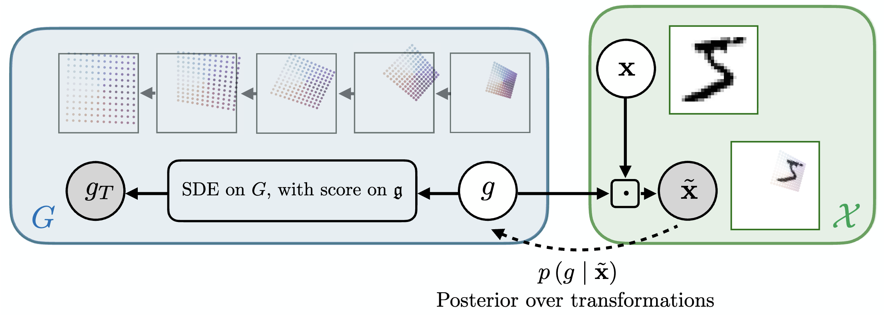

# Transformation-Inverting Energy Diffusion (PyTorch)

[](https://arxiv.org/abs/2602.08267) \
**Inverting Data Transformations via Diffusion Sampling** \
[Jinwoo Kim\*](https://jw9730.github.io), [Sékou-Oumar Kaba\*](https://oumarkaba.github.io/), [Jiyun Park](https://www.linkedin.com/in/jiyun-park/), [Seunghoon Hong†](https://maga33.github.io/), [Siamak Ravanbakhsh†](https://siamak.page/) (\* equal contribution, † equal advising) \
arXiv 2026



This codebase contains training and evaluation scripts for Transformation-Inverting Energy Diffusion (TIED). The codebase has been tested with NVIDIA A6000 GPUs.

## Setup

We recommend using the official PyTorch Docker image with CUDA support.

```bash
docker pull pytorch/pytorch:2.3.1-cuda12.1-cudnn8-devel
docker run -it --gpus all --ipc host --name tied -v /home:/home pytorch/pytorch:2.3.1-cuda12.1-cudnn8-devel bash
```

Assuming the codebase is located at `~/tied` inside Docker container, install the required packages and download the required data:

```bash
cd ~/tied
apt update && apt install -y git git-lfs
git lfs install
git lfs pull
pip3 install -r requirements.txt
```

## Running Experiments

Synthetic sampling task on SO(10)

```bash
python3 test_so_sampling.py --config configs/synthetic_so10/langevin.yaml
python3 test_so_sampling.py --config configs/synthetic_so10/diffusion.yaml
```

Affine/homography invariant image classification

```bash
# no transformation
python3 test_mnist_classification.py --config configs/padded_mnist/none.yaml

# affine transformation
python3 test_mnist_classification.py --config configs/affnist/none.yaml
# energy: VAE evidence lower bound
python3 test_mnist_classification.py --config configs/affnist/vae_ar_langevin.yaml
python3 test_mnist_classification.py --config configs/affnist/vae_ar_focal.yaml
python3 test_mnist_classification.py --config configs/affnist/vae_ar_its.yaml
python3 test_mnist_classification.py --config configs/affnist/vae_ar_lielac.yaml
python3 test_mnist_classification.py --config configs/affnist/vae_ar_diffusion.yaml
# energy: classifier logit confidence
python3 test_mnist_classification.py --config configs/affnist/logsumexp_langevin.yaml
python3 test_mnist_classification.py --config configs/affnist/logsumexp_focal.yaml
python3 test_mnist_classification.py --config configs/affnist/logsumexp_its.yaml
python3 test_mnist_classification.py --config configs/affnist/logsumexp_lielac.yaml
python3 test_mnist_classification.py --config configs/affnist/logsumexp_diffusion.yaml

# homography transformation
python3 test_mnist_classification.py --config configs/homnist/none.yaml
# energy: VAE evidence lower bound
python3 test_mnist_classification.py --config configs/homnist/vae_ar_langevin.yaml
python3 test_mnist_classification.py --config configs/homnist/vae_ar_focal.yaml
python3 test_mnist_classification.py --config configs/homnist/vae_ar_lielac.yaml
python3 test_mnist_classification.py --config configs/homnist/vae_ar_diffusion.yaml
# energy: classifier logit confidence
python3 test_mnist_classification.py --config configs/homnist/logsumexp_langevin.yaml
python3 test_mnist_classification.py --config configs/homnist/logsumexp_focal.yaml
python3 test_mnist_classification.py --config configs/homnist/logsumexp_lielac.yaml
python3 test_mnist_classification.py --config configs/homnist/logsumexp_diffusion.yaml
```

Point symmetry equivariant PDE solving

```bash
# heat PDE
python3 test_heat_pde.py --config configs/heat_pde/none.yaml
python3 test_heat_pde.py --config configs/heat_pde/langevin.yaml
python3 test_heat_pde.py --config configs/heat_pde/focal.yaml
python3 test_heat_pde.py --config configs/heat_pde/lielac.yaml
python3 test_heat_pde.py --config configs/heat_pde/diffusion.yaml

# heat PDE + data augmentation
python3 test_heat_pde.py --config configs/heat_pde/aug_none.yaml
python3 test_heat_pde.py --config configs/heat_pde/aug_langevin.yaml
python3 test_heat_pde.py --config configs/heat_pde/aug_focal.yaml
python3 test_heat_pde.py --config configs/heat_pde/aug_lielac.yaml
python3 test_heat_pde.py --config configs/heat_pde/aug_diffusion.yaml

# burgers PDE
python3 test_burgers_pde.py --config configs/burgers_pde/none.yaml
python3 test_burgers_pde.py --config configs/burgers_pde/langevin.yaml
python3 test_burgers_pde.py --config configs/burgers_pde/focal.yaml
python3 test_burgers_pde.py --config configs/burgers_pde/lielac.yaml
python3 test_burgers_pde.py --config configs/burgers_pde/diffusion.yaml
```

## References

Our implementation uses the code from the following repositories:

- [ITS](www.github.com/johSchm/ITS), [FoCal](https://github.com/sutkarsh/focal), [LieLAC](https://arxiv.org/abs/2410.02698), and [equivariant-convolutions](https://github.com/lemacdonald/equivariant-convolutions) for baselines
- [Metrics for Evaluating GANs](https://github.com/abdulfatir/gan-metrics-pytorch) for Fréchet Inception Distance (FID)

## Citation

If you find our work useful, please consider citing it:

```bib
@article{kim2026inverting,
  author    = {Jinwoo Kim and Sékou-Oumar Kaba and Jiyun Park and Seunghoon Hong and Siamak Ravanbakhsh},
  title     = {Inverting Data Transformations via Diffusion Sampling},
  journal   = {arXiv},
  volume    = {abs/2602.08267},
  year      = {2026},
  url       = {https://arxiv.org/abs/2602.08267}
}
```
